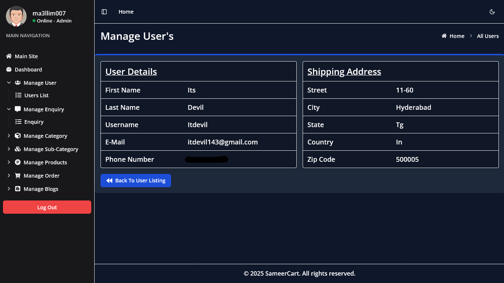

# sameerCart E-Commerce Project


## Overview

[SameerCart](https://sameercart.onrender.com/) is a full-featured eCommerce application designed to provide a seamless shopping experience. Users can browse products, add them to their cart, and complete secure purchases. The platform includes robust features like user authentication, product management, order tracking, and payment gateway integration.

## Features

-   Secure user authentication & authorization (Sign Up, Login, Logout, Password Reset)
-   Product browsing, and search functionality
-   Shopping cart and smooth checkout process
-   Order management and real-time order tracking
-   Secure payment gateway integration via Razorpay
-   Admin panel for managing users, products, orders, and content
-   Fully responsive design for mobile and desktop users

## Technologies Used

-   **Frontend:** React.js (with Context API & Hooks)
-   **Styling:** TailwindCSS And ShadCN
-   **Backend:** Node.js / Express.js
-   **Database:** MongoDB with Mongoose ORM
-   **Authentication:** JWT-based authentication
-   **Payment Gateway:** Razorpay for secure transactions
-   **Hosting & Deployment:** Render

## Installation

To set up the project locally, follow these steps:

### Frontend Setup

1. Navigate to the `client` directory:

    ```bash
    cd client
    ```

2. Install dependencies:

    ```bash
    yarn
    ```

3. Set up environment variables:

    ```bash
    cp .env.sample .env
    ```

    Update `.env` file with your credentials (e.g., Backend URL,etc.).

4. Start the frontend server:
    ```bash
    yarn start
    ```
    The frontend should be accessible at `http://localhost:5173`.

---

### Backend Setup

1. Navigate to the `server` directory:
    ```bash
    cd ../server
    ```
2. Install dependencies:
    ```bash
    yarn
    ```
3. Set up environment variables:

    ```bash
    cp .env.sample .env
    ```

    Update `.env` file with your credentials (e.g., database URI, Stripe keys, JWT secret, etc.).

4. Start the backend server:
    ```bash
    npm run dev
    ```
    The backend should be accessible at `http://localhost:8000`.

---

## Usage

To explore the application:

-   Visit the live website: [SameerCart](https://sameercart.onrender.com/)
-   Sign up or log in to access your personalized dashboard.
-   Browse products and add items to your shopping cart.
-   Proceed to checkout and make secure payments using Razorpay.
-   Track your order status in real-time.
-   **Admin users can log in to the Admin Panel to manage Users, Contact Enquiry, Category, Sub-Category, Products, Orders, And Blogs.**

## ⚠️ Warning & Danger Zone

-   **Use only test card details for payments** (provided by RazorPay in test mode).
-   **Do not enter real credit card information in the development environment.**
-   **Admin panel access is restricted to authorized users only.**
-   **Unauthorized transactions will not be refunded.**
-   Misuse of the platform may result in account suspension.

## Development & Contribution
### Steps to Contribute

1. Clone the repository:
    ```bash
    git clone https://github.com/ma3llim007/sameercart.git
    ```
2. Create a new branch:
    ```bash
    git checkout -b feature/your-feature-name
    ```
3. Implement your changes and commit:
    ```bash
    git add .
    git commit -m "Describe your changes here"
    ```
4. Push to GitHub:
    ```bash
    git push origin feature/your-feature-name
    ```
5. Open a pull request on GitHub and describe your changes.

## Contribution Guidelines
- Follow project structure and best practices.
- Submit detailed pull requests with clear descriptions.
- Report bugs and suggest improvements via GitHub Issues.

## License

This project is licensed under the MIT License - see the [LICENSE](LICENSE) file for details.

## Acknowledgements

-  React.js: Scalable and flexible frontend.
-  React Context API: Efficient state management.
-  TailwindCSS & Shadcn: Rich UI and styling.
-  Express.js & MongoDB: Robust backend architecture.
-  Razorpay: Secure and seamless payment processing.

<br>

---
<br>

# **Admin Dashboard**
The Admin Panel in [SameerCart](https://sameercart.onrender.com/) provides full control over the eCommerce platform, allowing administrators to manage users, categories, content inquiries, products, orders, and blogs efficiently.

## Key Features
- User Management: Handle user roles, authentication, and account statuses.
- Category & Sub-Category Management: Organize and structure product listings effectively.
- Content Inquiry Management: Track and respond to customer queries.
- Product Management: Maintain inventory, pricing, and promotions.
- Order Management: Process and update order statuses, refunds, and invoices.
- Blog Management: Publish and manage engaging content for customers.


### 1. User Management
- View, search, and filter registered users.
- Assign and manage user roles (Admin, Customer, Vendor).
- Activate, deactivate, or delete user accounts.
- Reset passwords and manage authentication settings.

#### Manage User's


#### View User Profile


### 2. Category & Sub-Category Management
- Create, edit, and delete categories and sub-categories.
- Assign icons or images for better navigation.
- Manage descriptions, SEO metadata, and sorting orders.

#### Manage Category's


#### Add Category


#### Edit Category


### 3. Content Inquiry Management
- View and respond to customer inquiries.
- Categorize and filter inquiries for quick access.
- Automate responses for common queries.

### 4. Product Management
- Add, update, and delete products.
- Manage product specifications, images, pricing, and stock levels.
- Assign categories and sub-categories.
- Enable discounts, offers, and promotional tags.

### 5. Order Management
- View and manage customer orders.
- Update order statuses (Pending, Processing, Shipped, Delivered, Canceled).
- Generate invoices and shipping labels.
- Handle customer refunds and returns.

### 6. Blog Management
- Create, edit, and delete blog posts.
- Manage categories and tags.
- Schedule posts and manage publishing settings.